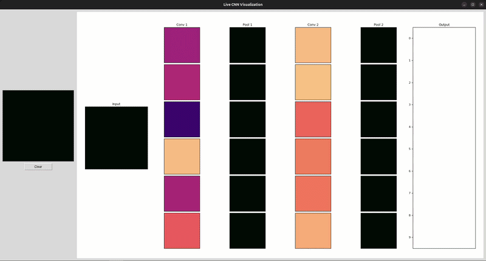
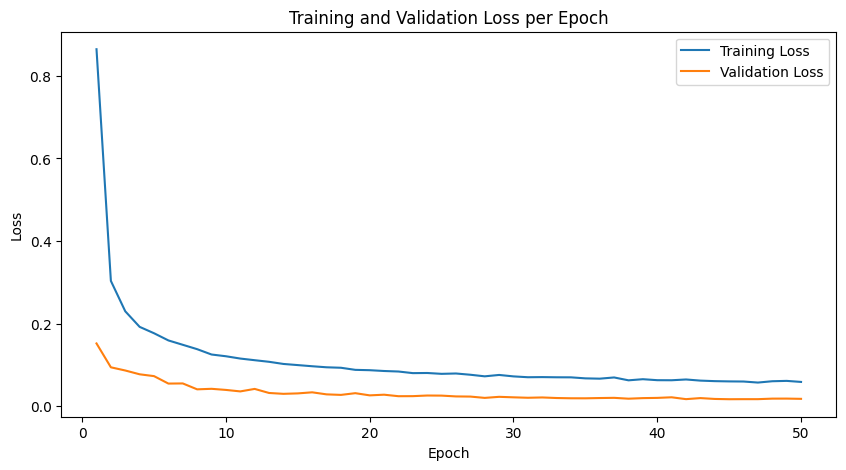
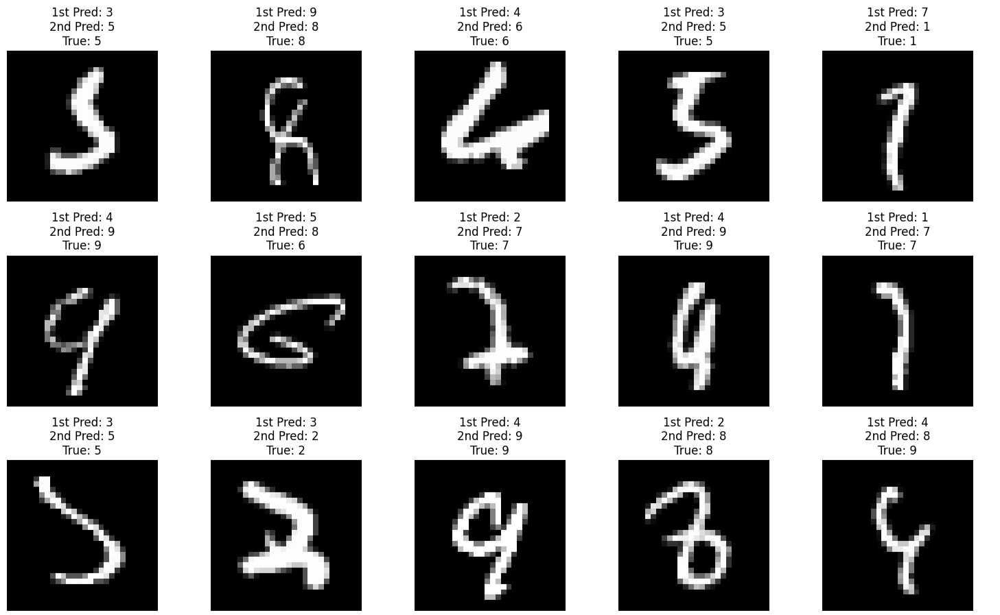

# Interactive PyTorch CNN Digit Classifier & Visualizer

## Overview
This project demonstrates the iterative development of a machine learning model for classifying handwritten digits. It includes an interactive user interface that visualizes real-time probability distributions and internal layer activations (convolutions and pooling) as the user draws.

## Live Demonstration

## Architecture Evolution
The project was built in three phases:

### 1. Baseline Model (Linear Network)
At first I implemented a simple linear neural network to establish a baseline performance metric and it reached 98.85% accuracy on the validation dataset. 

### 2. Architectural Upgrade (CNN)
To better capture the spatial hierarchies inherent in image data, I upgraded the architecture to a Convolutional Neural Network (CNN). This did improve validation accuracy over the baseline up to 99.4%

### 3. Engineering for Robustness (Data Augmentation)
Even with the CNN, the model trained strictly on the standard MNIST dataset failed to generalize to real-world inputs drawn via the UI, particularly when digits were drawn off-center or at varying scales.

To solve this, I used a custom PyTorch image transformation pipeline:
* **Resizing & Scaling:** Specifically added because the initial model consistently misclassified small "0"s as "9"s.
* **Random Translation:** This proved to help when drawing numbers off-center, since the MNIST dataset numbers are always perfectly centered.
* **Random Rotation:** Accommodates for naturally rotated handwriting. This rotation is kept small (-5 to 5 degrees) since a "9" rotated too far becomes a "6".

While these data augmentations only improved the CNN model's validation accuracy by 0.2%, they drastically improved its robustness and accuracy on live UI inputs.

## Development Process
* **Core Machine Learning:** The neural network architectures, PyTorch training pipelines, and custom data augmentation transformations were developed independently.
* **Visualization Interface:** The interactive frontend UI was generated using Claude's Sonnet 4.6 to visualize the model's real-time performance.

## Training Results
The CNN model was trained for 50 epochs. 

### Error Analysis
Below are the misclassified images.

## Tech Stack
* Python
* PyTorch
* CNN Architecture
* Data Augmentation (torchvision.transforms)

## How to Run
1. Clone the repository.
2. Install dependencies: `pip install -r requirements.txt`
3. Open `digit_classifier.ipynb` to view the training pipeline and launch the UI.
